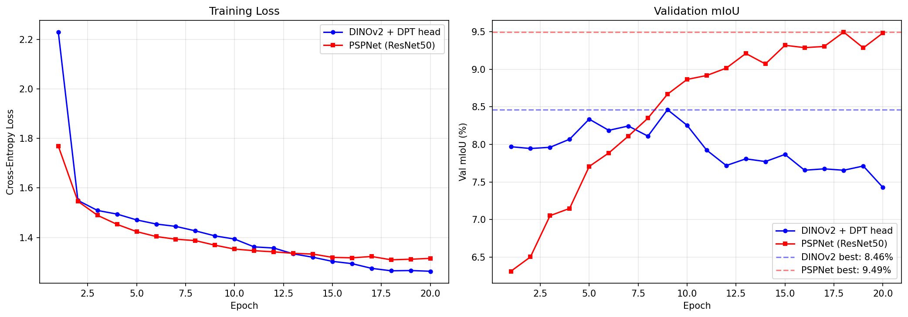
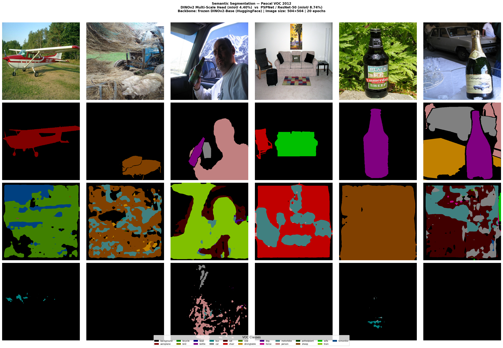
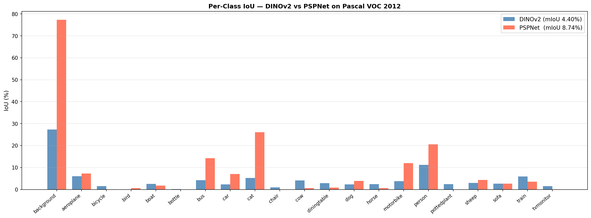
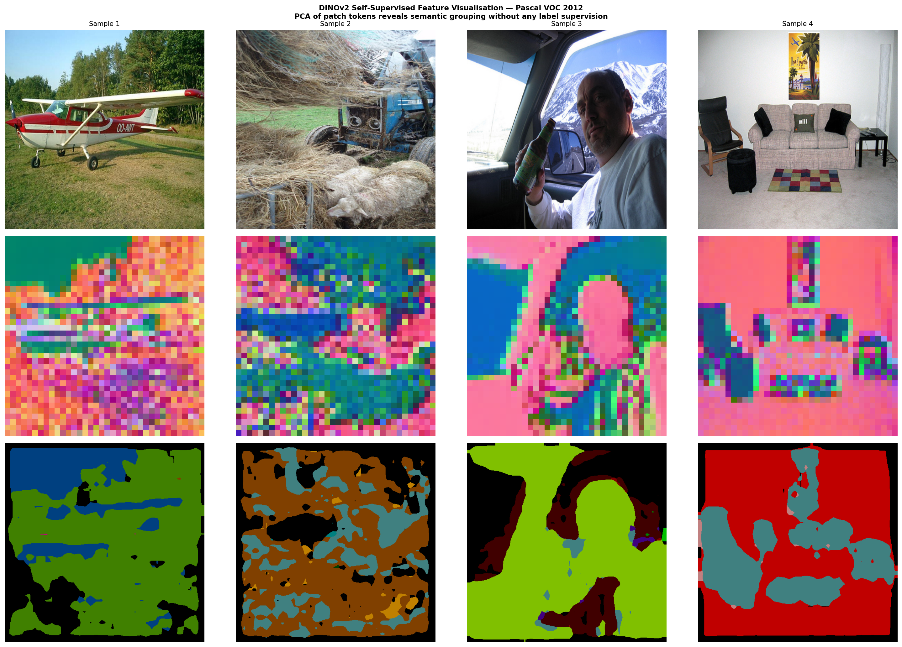
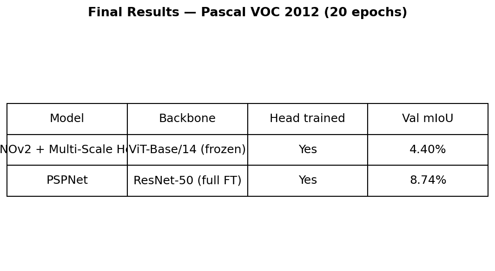

# DINOv2 + PSPNet Semantic Segmentation — Pascal VOC 2012

View full notebook (Google Colab):
https://colab.research.google.com/drive/1scaI8br_AniG_sn67HD9BAIXGvuaYQrS?usp=sharing

## Results — 20 epochs on Pascal VOC 2012 validation set

| Model | Backbone | Training | Val mIoU |
|---|---|---|---|
| PSPNet | ResNet-50 | Full fine-tuning | 8.74% |
| DINOv2 + Multi-Scale Head | ViT-Base/14 | Frozen backbone | 4.40% |

> Best mIoU during training: PSPNet **9.49%**, DINOv2 **8.46%**

---

## Training Curves



---

## Segmentation Results
*Rows: Input image / Ground truth / DINOv2 prediction / PSPNet prediction*



---

## Per-Class IoU Breakdown



---

## DINOv2 Self-Supervised Feature Visualisation (PCA)
*Patch tokens cluster semantically coherent regions with zero label supervision*



---

## Summary Table



---

## Key Observations

- PSPNet with full end-to-end fine-tuning converges steadily, still improving at epoch 20
- DINOv2 achieves lower training loss (1.25 vs 1.32) confirming strong frozen representations, but mIoU peaks at epoch 10 then drops — classic head overfitting on a small dataset (1,464 training images)
- Partial backbone unfreezing or a stronger decoder (UperNet / DPT) would close the gap

## Setup
```bash
pip install torch torchvision transformers scikit-learn matplotlib
```

Dataset: Pascal VOC 2012 | Image size: 504×504 | Loss: CrossEntropyLoss (ignore\_index=255, label\_smoothing=0.1)
